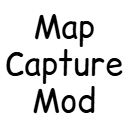

# Map Capture Mod

> 지도를 손에 들고 버튼을 누르기만 하면 지도를 캡처할 수 있습니다!

---

## 목차 (Table of Contents)
- [소개 (Introduction)](#소개-introduction)
- [기능 (Features)](#기능-features)
- [설치 방법 (Installation)](#설치-방법-installation)
- [사용법 (Usage)](#사용법-usage)
- [기여 방법 (Contributing)](#기여-방법-contributing)
- [라이센스 (License)](#라이센스-license)

---

## 소개 (Introduction)

지도를 캡처하려면 일반적으로 스크린샷을 찍은 후, 이미지에서 지도를 따로 추출하는 편집 작업이 필요합니다.  
하지만 이렇게 찍은 지도 이미지는 게임 내 시간과 주변 밝기의 영향을 받아, 여러 개의 지도 이미지를 조합할 때 밝기가 맞지 않는 문제가 발생할 수 있습니다.

이 모드는 이러한 문제를 해결합니다.  
왼손이 비어 있는 상태에서 오른손에 **지도**를 들고 촬영 버튼(기본: `O`)을 누르면, 들고 있는 지도의 이미지를 직접 추출할 수 있습니다.  
따라서 지도 이미지를 따로 편집할 필요가 없으며, 촬영 시간이나 주변 환경에 관계없이 항상 일정한 밝기의 지도 이미지를 제공합니다.

추출된 지도 이미지는 `screenshots/map` 폴더에 저장되며, 파일 이름에는 촬영 시간과 지도 위치 정보가 포함됩니다.  
또한, 이 모드는 **완전히 클라이언트에서만 동작**하므로, 서버 설정과 관계없이 사용할 수 있습니다.

**주의:**  
지도가 표시하는 장소에 대한 좌표 정보는 서버 측에 저장되므로, 지도 위치 추출 기능을 올바르게 사용하려면 **지도가 가리키는 지역 내에 서 있어야 합니다.**

---  

## 기능 (Features)

- [x] 항상 일정한 밝기의 지도 이미지 제공
- [x] 채팅창, 토스트 메시지, 아이템 툴팁 등 UI 요소 제거
- [x] 플레이어 위치 표시 제거
- [x] 한국어 지원

---

## 설치 방법 (Installation)

### 1. Fabric
이 모드는 기본적으로 Fabric 환경에서 동작합니다.  
Fabric 모드 로더를 설치해 주세요.

### 2. jar 파일
jar 파일을 `mods` 폴더에 위치시켜 주세요.

---

## 사용법 (Usage)

1. 오른손에 **지도**를 들고 있어야 합니다.
2. 왼손이 **비어 있는 상태**여야 합니다.
3. 촬영 버튼(기본: `O`)을 누르면 해당 지도 이미지가 추출됩니다.
4. 추출된 이미지는 `screenshots/map` 폴더에 저장됩니다.

---

## 기여 방법 (Contributing)

이 프로젝트에 기여하고 싶다면 다음 절차를 따라 주세요.

1. 저장소를 포크(fork)합니다.
2. 새로운 브랜치를 생성합니다. (`git checkout -b feature-branch`)
3. 변경 사항을 커밋합니다. (`git commit -m "설명 추가"`)
4. 브랜치에 푸시합니다. (`git push origin feature-branch`)
5. Pull Request를 생성합니다.

모든 기여는 환영합니다! 버그 리포트나 기능 제안을 남기고 싶다면 이슈를 등록해 주세요.

---

## 라이선스 (License)

이 프로젝트는 MIT 라이선스 하에 배포됩니다.  
자세한 내용은 [LICENSE](./LICENSE) 파일을 참고하세요.