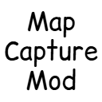

# Map Capture Mod

> You can capture the map only just by holding it in your hand and pressing a button!

---

## 목차 (Table of Contents)
- [소개 (Introduction)](#소개-introduction)
- [기능 (Features)](#기능-features)
- [설치 방법 (Installation)](#설치-방법-installation)
- [사용법 (Usage)](#사용법-usage)
- [기여 방법 (Contributing)](#기여-방법-contributing)
- [라이센스 (License)](#라이센스-license)

---

## 소개 (Introduction)
To capture a map, you usually need to take a screenshot and manually extract the map image through editing.  
However, these captured images are affected by in-game time and ambient lighting, which can cause brightness inconsistencies when combining multiple map images.

This mod solves these issues.  
If your **off-hand is empty** and you are holding a **filled map** in your main hand, you can press the capture button (default: `O`) to directly extract the map image.  
This eliminates the need for manual editing and ensures a consistent brightness level, regardless of the time of day or surrounding lighting conditions.

Extracted map images are saved in the `screenshots/map` folder, with filenames containing the capture time and map location information.  
Additionally, this mod **runs entirely on the client side**, meaning it can be used regardless of server settings.

**Note:**  
Since the coordinates of the mapped location are stored on the server, you **must be within the mapped area** for the position extraction feature to work correctly.

---  

## 기능 (Features)
- [x] Consistent brightness for captured map images
- [x] Removal of UI elements such as chat, toast messages, and item tooltips
- [x] Removal of player indicators
- [x] Support for the Korean language

---

## 설치 방법 (Installation)

### 1. Fabric
This mod works with the Fabric environment by default.  
Please install the Fabric mod loader.

### 2. jar File
Place the jar file in the `mods` folder.

---

## 사용법 (Usage)

1. You must hold a **map** in your right hand.
2. Your left hand must be **empty**.
3. Press the capture button (default: `O`) to extract the map image.
4. The extracted image will be saved in the `screenshots/map` folder.

---

## 기여 방법 (Contributing)

If you want to contribute to this project, please follow these steps:

1. Fork the repository.
2. Create a new branch. (`git checkout -b feature-branch`)
3. Commit your changes. (`git commit -m "Add description"`)
4. Push the branch. (`git push origin feature-branch`)
5. Create a Pull Request.

All contributions are welcome! If you want to report a bug or suggest a feature, please open an issue.

---

## 라이선스 (License)

This project is licensed under the MIT License.  
See the [LICENSE](./LICENSE) file for more details.